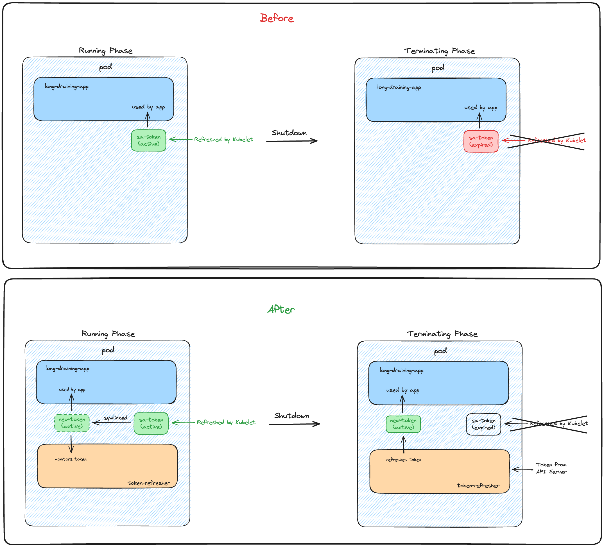

# Overview

The `service-account-token-refresher` tool is designed to ensure the continuous validity of the service account token used by EKS. It takes on the role of renewing the token when EKS doesn't, addressing a known issue where EKS ceases to refresh the token as a pod enters termination phase.

For more details on the issue, visit: [Kubelet stops rotating service account tokens when pod is terminating, breaking preStop hooks](https://github.com/kubernetes/kubernetes/issues/116481)

This issue particularly affects pods that require a significant amount of time, potentially hours or days, to shut down gracefully after Kubernetes sends a termination signal.

# Deployment Instructions

1. Build and push the Docker image using the provided Dockerfile to your preferred container registry.
2. Deploy the tool to your EKS cluster using the sample Kubernetes manifest found here: [examples/token-refresher.yaml](./examples/token-refresher.yaml)

# How It Works

The token refresher is designed to operate as a sidecar container alongside your main application that depends on the service account token. It generates a new token at a custom location and updates the main container to use this new path. The refresher goes through several key phases:

1. **Initialization**

   Initially, the refresher checks for the existence of a custom token. If it's missing, it sets up a symlink to the default EKS token.
   
2. **Monitoring**

   Then it enters a passive state where it periodically checks if the current token is expiring soon while waiting for a termination signal from Kubernetes.
   
   If it receives a shutdown signal (either from Kubernetes or the application) or it detects that the token is about to expire, it transitions to the active state.
   
3. **Refreshing**

   In the active state, the refresher begins to regularly request a new token from the Kubernetes API server before the current one expires. It includes robust error handling to manage potential API server issues. This process continues until the application signals the refresher to stop.

# Backstory

While moving a microservice to Kubernetes, we encountered a scenario where the service required over 24 hours to fully drain. We set up a PreStop hook and extended the `terminationGracePeriodSeconds` to accommodate this. However, we soon faced `ExpiredTokenException` errors.

Investigation led us to a bug in EKS, still unresolved as of March 2024, detailed here: [Kubelet stops rotating service account tokens when pod is terminating, breaking preStop hooks](https://github.com/kubernetes/kubernetes/issues/116481).

We attempted a workaround by extending the token expiration using the `eks.amazonaws.com/token-expiration` annotation, but it couldn't exceed 24 hours as discussed [here](https://github.com/aws/amazon-eks-pod-identity-webhook#amazon-eks-pod-identity-webhook). We then looked at the cluster level `service-account-max-token-expiration` flag, only to be blocked by an open feature request that prevented us from adjusting it ourselves: [Allow user to modify the kube-apiserver flag --service-account-max-token-expiration](https://github.com/aws/containers-roadmap/issues/1836).

We also considered using long-lived tokens, but they were incompatible due to a hardcoded issuer in the tokens, which was not accepted as per the error: `An error occurred (InvalidIdentityToken) when calling the AssumeRoleWithWebIdentity operation: Issuer must be a valid URL`. We needed the issuer to match the cluster's OIDC HTTP URL.

After exhausting all other available options, we decided to build our own token-refresher. It began as a simple shell script to fetch new tokens from the API server, but as complexity grew with retries and error handling, and with the need for better testing, we developed this Go-based service.

During testing, we encountered another hiccup where the refresher would start after the main container, causing errors due to the missing token. To resolve this, we added an init container to create the necessary symlink from the custom token to the default one at startup.

This refresher has proven to be very effective for us, and we hope it will be beneficial to you as well!
